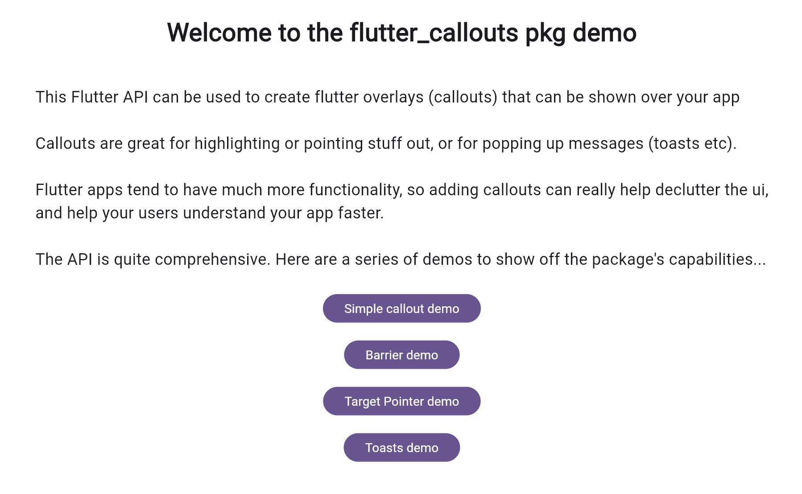
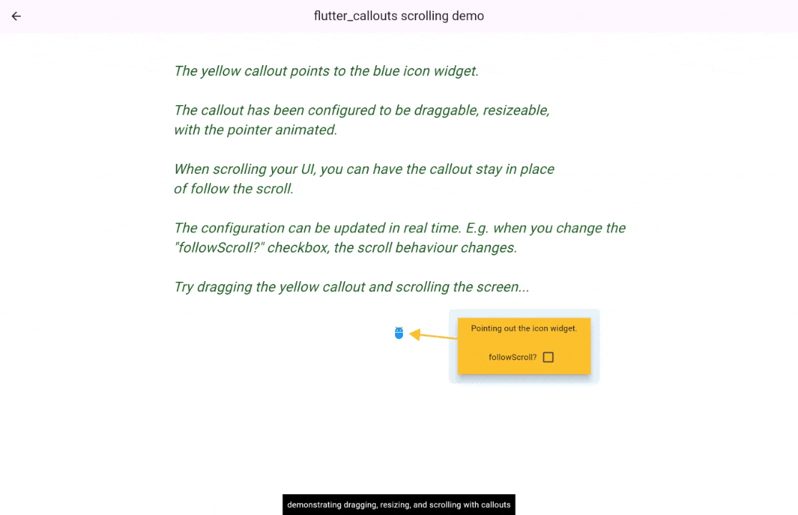
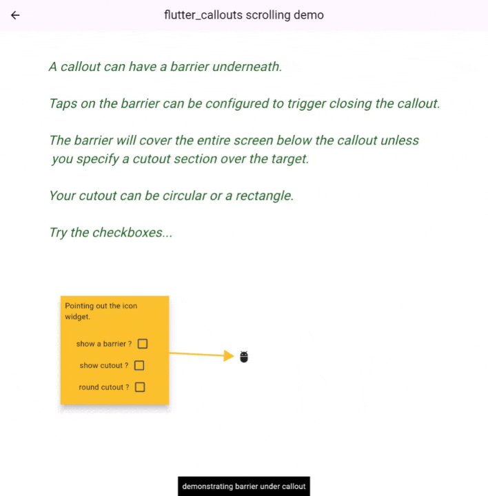
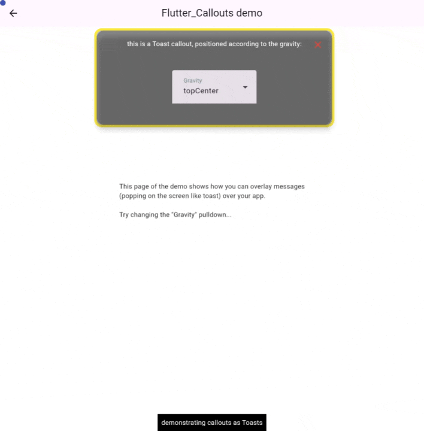

# *flutter\_callouts* package

## Key Concepts

The *flutter\_callouts* package allows you to pop up a content widget in a window; i.e. in a flutter overlay. This is the **callout**.

Often, you will want your callout to point to a **target** widget. This is very useful for providing help to the user by being able to point out ideas and related information. A callout overlay’s pointing line can follow its target widget \- this is achieved by assigning the target a GlobalKey. Using global keys makes it possible to track the size and position of target widgets on the screen.

It’s also useful to be able to pop up messages at pre-determined locations, such as centered at the top or bottom of the screen etc. These overlays are known as **toasts**.

## Motivation

This package allows communication with the user in a multitude of ways:

* pop up a callout widget that points to a target widget  
  (positioning using 2 values: **initialCalloutAlignment** & **initialTargetAlignment**)

* pop up a callout widget that has no target, but can be positioned on the screen  
  (positioned using an absolute screen coord: **initialCalloutPos**)

* pop up a callout widget as a Toast, positioned by an alignment value named **gravity**

* make it easy to allow dragging and resizing of callouts

* allow callouts to optionally follow scroll

* allow configuration of all aspects of callouts

* make configuration serializable (json)

## Quick Start

This project’s repository includes an example flutter app, that illustrates some of the more important capabilities of the api.




The intro page leads to 4 demo pages




Callout points out target widgets, and is draggable and can follow scroll




A barrier can be configured behind the callout, with a cutout for the target.


The callout pointer can be configured, as well as a line label, and many other options.




The callouts api can also be used to pop up toast from multiple directions .

## API Usage

To use this api, replace your use of MaterialApp with **FlutterCalloutsApp**, which actually creates a MaterialApp itself..

The *flutter\_callouts* package defines many classes, the most important of which are the following…

* **FlutterCalloutsApp** \- wraps your app.

* Global object **fca** \- you access the api using this global object
  (which is an instance of FlutterCalloutMixins).

* **Serializable property classes and enums** used to configure callouts:
  * AlignmentEnum
  * ArrowTypeEnum
  * ColorModel
  * DecorationShapeEnum
  * OffsetModel
  * UpTo6Colors \- models a gradient

* **CalloutConfigModel** \- the serializable callout configuration object. Its constructor takes many args, most of which, hopefully, are aptly named to not require explanation:

```dart 
CalloutConfigModel({
required this.cId,		// each callout has a unique id  
this.callerGK,
this.movedOrResizedNotifier,
This.gravity,			// used for Toasts
// "required" forces developer to consider scrolling
required this.scrollControllerName,
this.followScroll \= true,
this.forceMeasure \= false,
this.initialCalloutW,
this.initialCalloutH,
this.minWidth,
this.minHeight,
this.fillColor,
this.decorationShape \= DecorationShapeEnum.rectangle,
this.starPoints,		// used if callout shape is a star  
this.circleShape \= false,
this.noBorder \= false,
this.borderColor,
this.borderRadius \= 0,
this.borderThickness \= 0,
this.contentTranslateX,	// can offset the callout widget  
this.contentTranslateY,
this.targetTranslateX,	// can offset the target widget  
this.targetTranslateY,
this.arrowType \= ArrowTypeEnum.THIN,
this.arrowColor,
this.lengthDeltaPc \= 0.95,	// arrow length  
this.animate \= false,	// animate the pointing line  
this.toDelta,			// offset pointing line start  
this.fromDelta,		// offset pointing line end  
this.lineLabel,
this.barrier,
this.showCloseButton \= false,
this.closeButtonPos \= const Offset(10, 10),
this.onCloseButtonPressF,
this.closeButtonColor \= Colors.red,
this.initialTargetAlignment,	// used when pointing to a target widget  
this.initialCalloutAlignment,	// used when pointing to a target widget  
this.initialCalloutPos,	// used when no target widget to point to  
this.frameTarget \= false,
this.scaleTarget \= 1.0,
this.elevation \= 0,		// callout elevation  
this.dragHandleHeight,
this.draggable \= true,
this.canToggleDraggable \= false,
this.onDragF,
this.onDragEndedF,
this.onDragStartedF,
this.skipOnScreenCheck \= false,
this.resizeableH \= false,
this.resizeableV \= false,
this.onResizeF,
this.draggableColor,
this.showGotitButton \= false,
this.gotitAxis,
this.onGotitPressedF,
this.showcpi \= false,
this.onlyOnce,		// only show this callout once  
this.containsTextField \= false,
this.alwaysReCalcSize \= false,
this.ignoreCalloutResult \= false,
this.finalSeparation,	// on initial display, animates to this separation  
this.onDismissedF,		// callback when callout dismissed  
this.onTickedF,
this.onHiddenF,
this.onAcceptedF
})
```

## Saving as json
This package allows you to configure your callouts in dart, but there is another package, *flutter\_content*, built on this one, that enables users to create and configure callouts **visually**,
and have their configuration stored in their firestore database.
(specifically, referring to the **hotspots** functionality of flutter\_content).
This is made possible by using the dart\_mappable package to make the configuration serializable to json.
